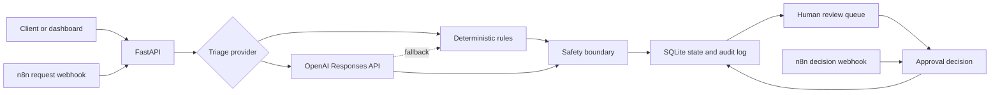

# AI Ops Approval Workflow

[](https://github.com/Umbura/ai-ops-approval-workflow/actions/workflows/ci.yml)
[](https://www.python.org/)
[](LICENSE)

AI-assisted operational request triage with human approval, audit logging, and n8n orchestration.

The system receives operational requests, classifies category and risk, applies deterministic safety rules, stores workflow state, and records human decisions. It runs with deterministic local triage by default or with the OpenAI Responses API and Structured Outputs.

## Core Capabilities

- FastAPI request, decision, metrics, audit, health, and configuration endpoints.
- Operational dashboard for queue review and human decisions.
- Deterministic local triage with no external API requirement.
- OpenAI Responses API provider with strict JSON Schema output.
- Deterministic fallback when the LLM provider is unavailable.
- Forced human review for high-risk requests.
- SQLite persistence with idempotency and audit events.
- API-key protection using `X-API-Key`.
- Protected n8n request and decision webhooks.
- Reproducible Docker Compose environment.
- Automated tests, lint, frontend validation, container build, and CI.

## Architecture



FastAPI owns business rules and state transitions. n8n provides external orchestration. The model can suggest a next action but cannot execute a final operational action.

## Quick Start

### Docker Compose

Requirements:

- Docker Desktop with Compose v2.

Create the local configuration and start both services:

```bash
cp .env.example .env
docker compose up --build -d
```

Available services:

| Service | URL |
| --- | --- |
| Approval dashboard | http://127.0.0.1:8000 |
| OpenAPI documentation | http://127.0.0.1:8000/docs |
| n8n editor | http://127.0.0.1:5678 |

Default local development values:

```text
API key: local-development-key
Webhook secret: local-webhook-secret
```

These values are development defaults. Replace `AI_OPS_API_KEY`, `AI_OPS_WEBHOOK_SECRET`, and `N8N_ENCRYPTION_KEY` before exposing the services outside localhost.

Stop the environment:

```bash
docker compose down
```

Persistent API and n8n data remain in named Docker volumes.

### Local Backend

Requirements:

- Python 3.11 or newer.
- [uv](https://docs.astral.sh/uv/).

Install and start:

```bash
uv sync --dev --locked
uv run uvicorn ai_ops_approval.main:app --reload
```

Authentication is disabled when `AI_OPS_API_KEY` is empty. This mode is intended only for local development.

## Dashboard

The dashboard provides:

- request queue and status filtering;
- category, priority, confidence, and risk context;
- suggested action and model rationale;
- approval, rejection, and change-request decisions;
- aggregate metrics;
- audit-event inspection;
- desktop and mobile layouts.

When API authentication is enabled, the key is entered in the connection dialog and retained only in browser session storage.

## API

Protected endpoints require:

```http
X-API-Key: <AI_OPS_API_KEY>
```

| Method | Endpoint | Purpose |
| --- | --- | --- |
| `GET` | `/health` | Runtime and provider status |
| `POST` | `/requests` | Create and triage a request |
| `GET` | `/requests` | List and filter requests |
| `GET` | `/requests/{request_id}` | Retrieve one request |
| `POST` | `/requests/{request_id}/decision` | Record a human decision |
| `GET` | `/metrics` | Retrieve workflow metrics |
| `GET` | `/audit` | Retrieve audit events |

Request creation supports an optional idempotency header:

```http
Idempotency-Key: <unique-operation-key>
```

Repeated calls with the same key return the existing request without running triage again.

## n8n Workflow

The canonical export is [workflows/ai_ops_approval_n8n.json](workflows/ai_ops_approval_n8n.json). Docker Compose imports and publishes it automatically in n8n `2.29.10`.

Webhook endpoints:

- `POST /webhook/ai-ops-request`
- `POST /webhook/ai-ops-decision`

Both webhooks require:

```http
X-Webhook-Secret: <AI_OPS_WEBHOOK_SECRET>
```

Example request:

```bash
curl -X POST http://127.0.0.1:5678/webhook/ai-ops-request \
  -H "Content-Type: application/json" \
  -H "X-Webhook-Secret: local-webhook-secret" \
  -H "X-Idempotency-Key: example-request-001" \
  --data @examples/high_priority_request.json
```

The workflow contains no credentials. Runtime values are injected through environment variables.

## LLM Configuration

No-cost deterministic mode:

```env
AI_OPS_LLM_MODE=mock
```

OpenAI mode:

```env
AI_OPS_LLM_MODE=openai
OPENAI_API_KEY=your_key_here
AI_OPS_OPENAI_MODEL=gpt-5.4-mini
AI_OPS_LLM_FALLBACK_ENABLED=true
```

The provider sends `store: false`, requests a strict structured object, and applies deterministic safety checks after parsing the response.

### Real API Validation

One paid smoke test was executed on 2026-07-11 using `gpt-5.4-mini`:

| Field | Result |
| --- | --- |
| Category | `fraud_risk` |
| Priority | `critical` |
| Confidence | `0.98` |
| Human review | `true` |

Automated tests use a mocked HTTP transport and do not consume API credits.

## Safety Controls

Human review is forced for:

- high or critical priority;
- fraud, chargeback, or security signals;
- high amount at risk;
- VIP, enterprise, or strategic customers;
- destructive actions;
- low-confidence deterministic classifications.

Additional controls include:

- strict request validation;
- 16 KB metadata limit;
- API-key comparison using constant-time verification;
- generic upstream error responses;
- webhook-secret validation;
- idempotent request creation;
- final-state conflict protection;
- persistent audit events.

## Verification

Current local results:

| Check | Result |
| --- | ---: |
| Automated tests | 12 passed |
| Python lint | passed |
| Python compilation | passed |
| JavaScript syntax | passed |
| n8n JSON validation | passed |
| Docker Compose validation | passed |
| API container build | passed |
| Real OpenAI smoke test | passed |
| Real n8n request and decision flow | passed |
| Desktop dashboard validation | passed |
| Mobile layout at 390 x 844 | passed |

Run the local checks:

```bash
uv run pytest -q
uv run ruff check .
uv run python -m compileall -q src tests
node --check src/ai_ops_approval/static/app.js
python -m json.tool workflows/ai_ops_approval_n8n.json
docker compose config --quiet
docker build --tag ai-ops-approval:test .
```

## Repository Layout

```text
docker/                         n8n container initialization
docs/                           architecture and demonstration notes
examples/                       request payloads
src/ai_ops_approval/            API, triage, persistence, and settings
src/ai_ops_approval/static/     approval dashboard
tests/                          unit and integration tests
workflows/                      canonical n8n workflow export
compose.yml                     local multi-service runtime
Dockerfile                      API container image
```

## Production Boundaries

Version `1.0.0` is a complete local portfolio application. A production deployment should additionally provide:

- TLS and a reverse proxy;
- unique secrets managed outside source control;
- PostgreSQL with managed migrations;
- user identity and role-based authorization;
- rate limiting and centralized observability;
- database backups and restore procedures;
- a managed deployment target.

## References

- [OpenAI Responses API](https://developers.openai.com/api/reference/resources/responses/methods/create/)
- [OpenAI Structured Outputs](https://developers.openai.com/api/docs/guides/structured-outputs)
- [GPT-5.4 mini model](https://developers.openai.com/api/docs/models/gpt-5.4-mini)
- [n8n Docker installation](https://docs.n8n.io/hosting/installation/docker/)

License and reuse decisions are documented in [docs/reuse_and_license.md](docs/reuse_and_license.md).
