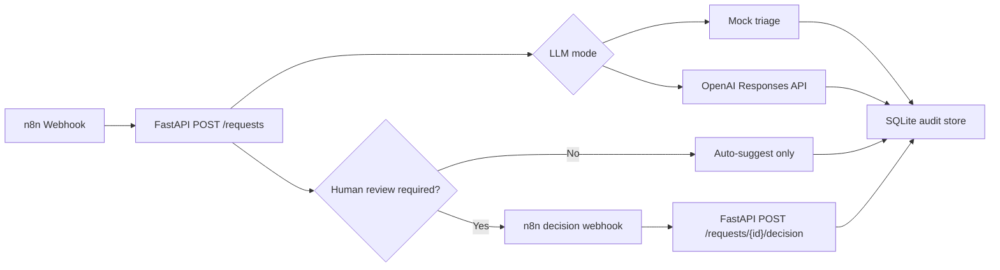

# Architecture

## MVP Architecture

## Why FastAPI Owns Business Logic

n8n is excellent for orchestration and visibility, but business rules need tests, version control and clear APIs. This backend keeps triage, status transitions and audit logging in Python.

## Why Mock AI Still Exists

The MVP must work without API keys or credit spend. The deterministic triage engine remains as the default mode and as a fallback if OpenAI mode fails.

## OpenAI Mode

When `AI_OPS_LLM_MODE=openai`, the backend calls the OpenAI Responses API and asks for a structured JSON response. The backend still applies a deterministic safety boundary: high-risk requests are forced into human review even if the model output says otherwise.

## Human Approval Rule

The system never executes a sensitive final action directly. It only suggests an action and records a human decision.
