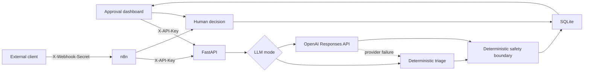

# Architecture

## Runtime Components

## Ownership

FastAPI owns:

- request validation;
- authentication;
- payload-bound idempotency;
- triage-provider selection;
- deterministic safety enforcement;
- state transitions;
- persistence and audit events;
- dashboard assets.

n8n owns:

- external webhook ingress;
- fail-closed webhook-secret validation;
- transport-payload sanitization;
- API orchestration;
- response shaping;
- validated decision-webhook routing.

The dashboard is an operational client. It does not contain business rules or direct database access.

## Persistence

SQLite stores requests, decisions, and audit events. Initialization applies additive schema migrations for idempotency keys and payload fingerprints, enables foreign keys, configures a busy timeout, creates query indexes, and uses WAL mode.

Decision validation, persistence, status transition, and audit insertion execute under one immediate transaction. Concurrent attempts cannot finalize the same request independently.

SQLite is appropriate for the local V1. A multi-instance production deployment should use PostgreSQL and managed migrations.

## Safety Boundary

Model output cannot bypass deterministic review rules. High or critical priority, fraud signals, high-value requests, sensitive customer tiers, and destructive actions always require human review.

The model receives only triage fields. Requester identifiers and arbitrary metadata are excluded from the external provider payload.

The system records decisions but does not execute a sensitive final operational action.

## Runtime Packaging

Docker Compose starts:

- the FastAPI image built from `Dockerfile`;
- n8n `2.29.10`;
- persistent API and n8n volumes.

The n8n entrypoint imports and publishes the canonical workflow at every start. The workflow JSON remains the source of truth.

Compose ports bind to `127.0.0.1`. The dashboard adds CSP, SRI, frame protection, MIME-sniffing protection, referrer restrictions, and a restrictive permissions policy.
