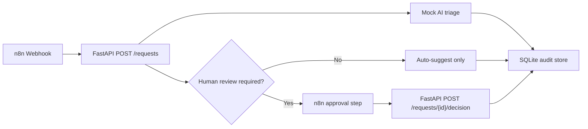

# Architecture

## MVP Architecture

## Why FastAPI Owns Business Logic

n8n is excellent for orchestration and visibility, but business rules need tests, version control and clear APIs. This backend keeps triage, status transitions and audit logging in Python.

## Why Mock AI First

The MVP must work without API keys or credit spend. The current triage engine is deterministic and easy to test. A later version can swap it for a real LLM while keeping the same response schema.

## Human Approval Rule

The system never executes a sensitive final action directly. It only suggests an action and records a human decision.

